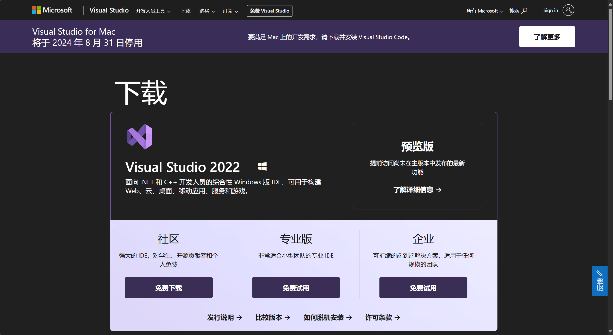
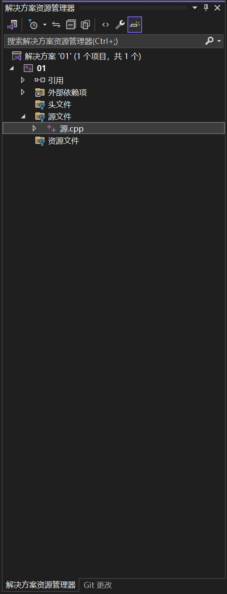

#C++编译软件visual studio 2022的下载与使用
##打开链接https://visualstudio.microsoft.com/downloads/  

##选择社区版 下载安装  
这里进入选择工作负载界面 下拉找到图片中打勾的两项（我们以c++为主）  

安装它们，这可能需要一定时间，等待安装结束即可……（安装路径可以更改，根据个人需求，默认在c盘）  
(为了防止系统对编写的代码报风险以删除，通常可以右键开始菜单-设置-Windows安全中心-病毒和威胁防护-找到“病毒和威胁防护设置”栏下点开“管理设置”-排除项-添加vs所在的文件夹，可以规避系统对代码的消杀。若安装在c盘，这里可以直接选择c盘作为排除项，方便快捷。不在c盘则选到对应文件夹即可）
##回归正题  
安装结束后，需要登陆微软账号（若无则注册）
##选择“创建新项目”

##筛选为c++语言，选择空项目创建

##在右侧的树中右键“源文件”添加-新建项，在新建源文件中就可以编译了。

##编辑完成代码后，在上方找到“调试”-“开始调试”即可试验运行代码，也可使用快捷键f5直接调试。
