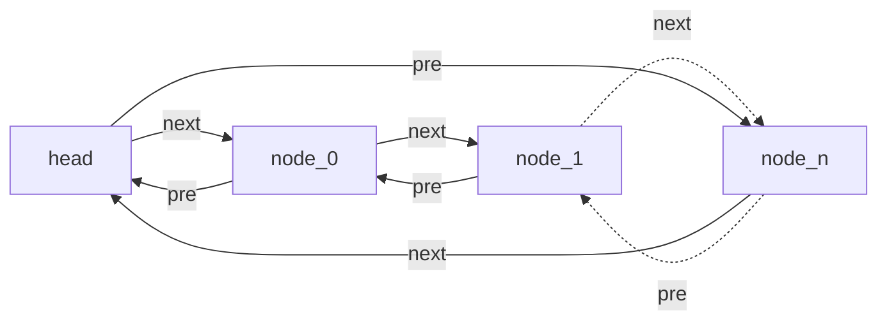
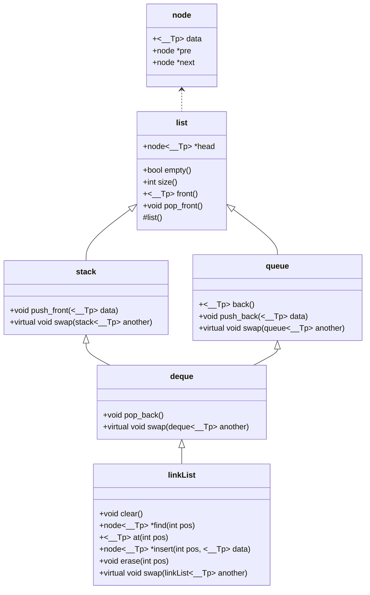

# 基于C++面向对象与模板以带有头节点的环形双向链表为基础，对链表、栈、队列和双向队列的实现

作者：10234507025[ChiyoYuki](https://github.com/ChiyoYuki)

 <p xmlns:cc="http://creativecommons.org/ns#" >本文及代码文件遵循 <a href="https://creativecommons.org/licenses/by/4.0/?ref=chooser-v1" target="_blank" rel="license noopener noreferrer" style="display:inline-block;">CC BY 4.0共享协议</a></p>

注：尚在更新，下一步

1. 代码部分更细致的讲解
2. 实现更多功能
3. 冗余代码优化
4. 实现pair等其他STL类

## 采用带有头节点的环形双向链表的原因？



此为**带有头节点的环形双向链表**的结构示意图，不难看出，在已知头节点的情况下，找到第一个节点、尾节点的时间复杂度均为O(1)，寻找任意节点的前节点与后节点的时间复杂度也为O(1)，处理部分操作时速率更快，便于后续结构的实现。

## 明确需求

参考[OI Wiki中对于STL中序列式容器的介绍](https://oi-wiki.org/lang/csl/sequence-container/#list-%E7%9A%84%E4%BD%BF%E7%94%A8%E6%96%B9%E6%B3%95)，结合自身能力，大致实现如下功能：

### 栈

- `empty()`：`true`为空，`false`为非空。
- `pop_front()`：弹出栈顶元素。
- `push_front()`：将元素压入栈顶。
- `size()`：返回栈的元素个数。
- `swap()`：与另一个栈交换。
- `front()`：返回栈顶元素。

### 队列

- `back()`：返回队尾元素
- `front()`：返回队首元素
- `empty()`：`true`为空，`false`为非空。
- `pop_front()`：删除队首元素
- `push_back()`：在队尾插入一个元素
- `size()`：返回元素个数
- `swap()`：交换两个队列

### 双向队列

- `front()`：返回队首元素
- `back()`：返回队尾元素
- `empty()`：`true`为空，`false`为非空
- `push_front()`：在队首插入一个元素
- `pop_front()`：删除队首的元素
- `push_back()`：在队尾插入一个元素
- `pop_back()`：删除队尾的元素
- `size()`：返回元素个数
- `swap()`：交换两个双向队列

### 链表

- `at()`：返回指定位置元素的引用
- `front()`：返回首元素的引用
- `back()`：返回尾元素的引用
- `begin()`：返回指向首元素的指针
- `end()`：返回指向尾端占位符元素的指针，在该实现方案中，返回的是指向头节点的指针
- `rbegin()`：返回指向末元素的指针
- `rend()`：返回指向首元素前一位置的指针，在该实现方案中，返回的是指向头节点的指针
- `empty()`：`true`为空，`false`为非空
- `size()`：返回元素数量
- `clear()`：清除所有元素
- `insert()`：在指定位置插入元素并返回指向插入元素的指针
- `erase()`：删除指定位置的元素
- `push_front()`：在开头插入一个元素
- `pop_front()`：删除开头的元素
- `push_back()`：在末尾插入一个元素
- `pop_back()`：删除末尾的元素
- `swap()`：交换两个链表

为了避免涉及到相同函数重命名的问题，上文将实现功能一致的函数命名统一。

因为不同的类之间存在相同的成员函数，所以可以构建如下的继承关系：



## 造轮子 Time

### 定义节点模板

该过程定义了链表的单个节点，其中data储存节点数据，pre指向上一节点，next指向下一节点。

```cpp
template <typename __Tp>
class node
{
public:
    __Tp data;
    class node *pre;
    class node *next;
};
```

### 定义新建节点模板函数

该过程用以申请内存创建新节点，并返回指向该节点的指针。

~~或许是可以写在节点构造函数的，但是能力受限就单拎出来了~~

```cpp
template <typename __Tp>
node<__Tp> *newNode()
{
    // malloc申请内存
    // 变量名与函数名重名似乎不是什么好习惯？
    node<__Tp> *newNode = (node<__Tp> *)malloc(sizeof(node<__Tp>));
    // 将新节点的指针变量赋值为NULL，防止后续调用时访问到不该访问的内存
    newNode->pre = NULL;
    newNode->next = NULL;
    //返回指向节点的指针
    return newNode;
}
```

### 定义表模板类

该过程创建最基础的表模板类，用作后续类的父类。

```cpp
template <typename __Tp>
class list
{
public:
    node<__Tp> *head; //头节点指针变量
    
protected:
    list() //初始化时创建一个仅有头节点的链表，并将其前后指针均指向自己
    {
        head = newNode<__Tp>();
        head->pre = head;
        head->next = head;
    }
};
```

#### 实现`empty()`函数

根据带有头节点的环形链表的特征，当且仅当头节点的后继节点也为头节点时，链表为空。

```cpp
    bool empty() { return (head->next == head); }
```

#### 实现`size()`函数

通过遍历链表的形式计算链表长度。

也可在表模板类中添加`int size`成员变量，记录链表的长度，这么做的好处是查询长度的时间复杂度可以从O(n)降为O(1)，但是需要在后续每次对表进行增删操作时更新。

```cpp
    int size()
    {
        node<__Tp> *now = this->head; //将now指针指向头节点
        int count = 0; // 初始化计数变量
        while (now->next != this->head)
        {
            count++;
            now = now->next;
        }
        return count;
    }
```

#### 实现`front()`与`pop_front()`函数

定义front()函数与pop_front()函数。

```cpp
    __Tp front() //若表非空，直接返回表头后继节点的data
    {
        if (!this->empty())
            return this->head->next->data;
    }

    // front()函数本应该在表为空的时候直接退出
    // 一般情况下需要返回0
    // 但是我没查到泛型怎么返回空值
    // 后续的back()函数也存在这个问题
    // 所以这里会报一个Warning

    void pop_front()
    {
        if (empty())
            return;
        node<__Tp> *popNode = head->next; //设定临时指针变量指向被删除的节点
        popNode->pre->next = popNode->next; //修改被删除节点前后节点的指针关系
        popNode->next->pre = popNode->pre;
        free(popNode);
    }
```

### 定义栈模板类

该过程创建栈的模板类

```cpp
template <typename __Tp>
class stack : virtual public list<__Tp> //此处要使用虚类继承，不然后续在类deque中调用类list成员的时候会冲突
{
public:
    
};
```

#### 实现`push_front()`函数

该过程实现push_front()函数，相当于进栈操作

```cpp
    void push_front(__Tp data)
    {
        node<__Tp> *pushNode = newNode<__Tp>(); //申请内存，创建新节点
        pushNode->data = data; //存储节点数据
        pushNode->pre = this->head; //修改节点的指针关系
        pushNode->next = this->head->next;
        pushNode->pre->next = pushNode; //修改节点前后节点的指针关系
        pushNode->next->pre = pushNode;
    }
```

#### 实现`swap()`函数

实现交换函数，本来这个函数也应该写在list类继承的，但是swap函数参数变量要一致，我就不会了，只好在每个需要实现swap的类中重新定义一次虚函数

```cpp
    virtual void swap(stack<__Tp> another)
    {
        node<__Tp> *swapNode = another.head;
        swapNode = this->head; //由于another作为形参传入，执行完这一行之后，函数内的another并不会改变
        this->head = another.head;
        return;
    }
```

### 定义队列模板类

```cpp
template <typename __Tp>
class queue : virtual public list<__Tp> //此处要使用虚类继承，理由同上
{
public:
    
};
```

#### 实现`back()`与`push_back()`函数

实现过程与上文类似，请参考前文

```cpp
    __Tp back()
    {
        if (!this->empty())
            return this->head->pre->data;
    }

    void push_back(__Tp data)
    {
        node<__Tp> *pushNode = newNode<__Tp>();
        pushNode->data = data;
        pushNode->next = this->head;
        pushNode->pre = this->head->pre;
        pushNode->pre->next = pushNode;
        pushNode->next->pre = pushNode;
    }
```

#### 实现`swap()`函数

同stack的swap()函数

```cpp
    virtual void swap(queue<__Tp> another)
    {
        node<__Tp> *swapNode = another.head;
        swapNode = this->head;
        this->head = another.head;
        return;
    }
```

### 定义双向队列模板类

需要提醒的是，这里的双向队列类并并不是C++STL库中的deque，下文的链表类更接近STL中的deque

```cpp
template <typename __Tp>
class deque : public stack<__Tp>, public queue<__Tp>
{
public:
    
};
```

#### 实现`pop_back()`函数

```cpp
    void pop_back()
    {
        if (this->empty())
            return;
        node<__Tp> *popNode = this->head->pre;
        popNode->pre->next = popNode->next;
        popNode->next->pre = popNode->pre;
        free(popNode);
    }
```

#### 实现`swap()`函数

```cpp
    virtual void swap(deque<__Tp> another)
    {
        node<__Tp> *swapNode = another.head;
        swapNode = this->head;
        this->head = another.head;
        return;
    }
```

### 定义链表模板类

```cpp
template <typename __Tp>
class linkList : public deque<__Tp>
{
public:

};
```

#### 实现`begin()`、`end()`、`rbegin()`、`rend()`函数

坦白讲没看懂迭代器的实现机制，所以暂时用指针代替。

```cpp
    node<__Tp> *begin() { return this->head->next; }
    node<__Tp> *end() { return this->head; }
    node<__Tp> *rbegin() { return this->head->pre; }
    node<__Tp> *rend() { return this->head; }
```

#### 实现`swap()`函数

```cpp
    virtual void swap(linkList<__Tp> another)
    {
        node<__Tp> *swapNode = another.head;
        swapNode = this->head;
        this->head = another.head;
        return;
    }
```

#### 实现`clear()`函数

clear()函数可以移动到父类中，但考虑到STL当中的stack与queue均没有clear()函数，故在此点上保持一致。

```cpp
    void clear()
    {
        node<__Tp> *now = this->head->next;
        node<__Tp> *del = now;
        while (now != this->head) //遍历整个表，循环删除所有的非表头节点
        {
            del = now;
            now = now->next;
            free(del);
        }
        this->head->pre = this->head;
        this->head->next = this->head;
        return;
    }
```

#### 实现`find()`函数

该函数并不在主要实现功能中，其作用是给定一个返回第pos个节点的地址，但是后续的at()，insert()，erase()函数均需要类似的功能，故将其整合为一个独立的函数

> 需要注意的是，遵循惯例，节点下标从0开始计算

```cpp

    node<__Tp> *find(int pos)
    {
        int count = -1;
        node<__Tp> *now = this->head;
        //now!=this->head判断是否遍历完整个表
        //count==-1判断还为开始计数的特例
        //pos>count判断是否到达指定位置
        //之所以不用pos!=count是怕有人传个-1进来
        while ((now != this->head || count == -1) && pos > count)
        {
            count++;
            now = now->next;
        }
        if (pos == count && now != this->head)//判断是否找到对应位置的节点
            return now;
        else
            return NULL;
    }
```

#### 实现`at()`函数

这个at()函数应该是残缺的，只实现了读取，写入没有实现，并存在与上文front()函数同样的不知道返回什么的问题。

```cpp
    __Tp at(int pos)
    {
        node<__Tp> *now = find(pos);
        if (now != NULL)
            return find(pos)->data;
    }
```

#### 实现`insert()`函数

在指定位置插入节点，使其成为第pos个节点，思想是找到第pos-1个节点，并在之后插入新节点。

不在第pos个节点之前插入节点是因为第pos个节点在插入前可能不存在

```cpp

    node<__Tp> *insert(int pos, __Tp data)
    {
        node<__Tp> *now = find(pos - 1);
        if (now != NULL)
        {
            node<__Tp> *insNode = newNode<__Tp>();
            insNode->data = data;
            insNode->pre = now;
            insNode->next = now->next;
            insNode->pre->next = insNode;
            insNode->next->pre = insNode;
            return insNode;
        }
    }
```

#### 实现`erase()`函数

找到第pos个节点然后free掉

```cpp
void erase(int pos)
    {
        node<__Tp> *now = find(pos);
        if (now != NULL)
        {
            now->pre->next = now->next;
            now->next->pre = now->pre;
            free(now);
            return;
        }
    }
```