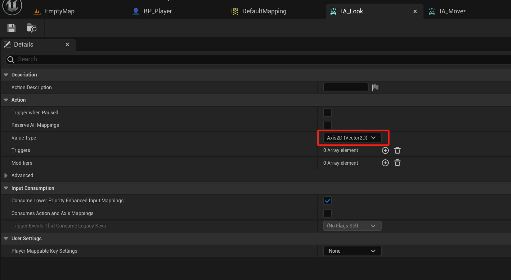

# 3.1

## 创建Inputmapping Context和Input Action

### Input Mapping Context

输入映射上下文(Input Mapping Context)是一个定义了哪些输入键触发哪些输入动作的规则集合。它们通常与特定的游戏状态相关联，比如游戏中的主菜单、游戏中的行走状态等。可以通过编辑项目设置或蓝图脚本来创建和管理输入映射上下文(Input Mapping Context)。

### Input Action
Input Action代表了玩家可以执行的某种动作，比如跳跃、射击、打开菜单等。输入动作通常与键盘按键、鼠标按钮或游戏手柄按钮相关联。在可以通过编辑输入映射来创建和管理输入动作，然后可以在蓝图或代码中监听这些输入动作，以便在玩家执行相应操作时触发相应的逻辑

### 实战

