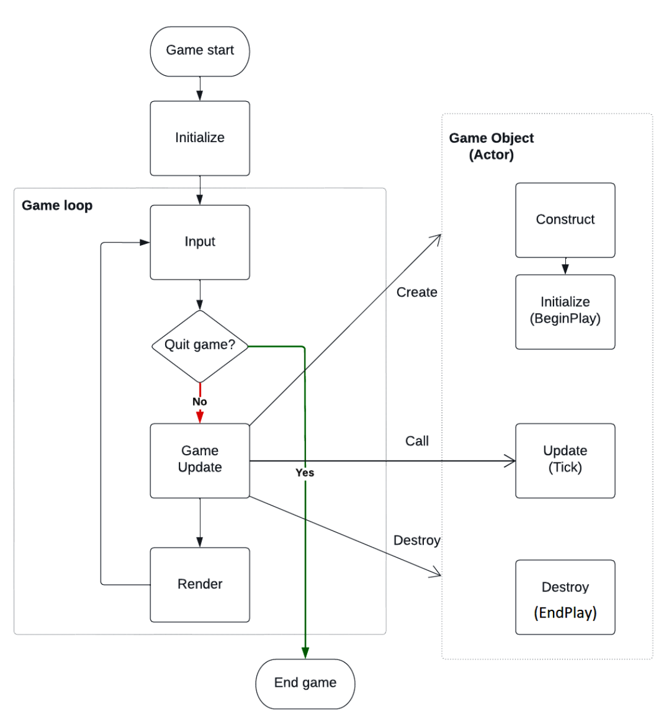

# 6.2

## 虚幻中游戏是怎样运行起来的

### 虚幻中的game program structure



### PlayerController中的OnPosses方法

通常情况下，你只有在需要在玩家控制器(APlayerController)接管角色时执行特定的逻辑时才需要重写OnPossess函数
1. 初始化角色状态；当玩家控制器接管一个角色时，你可能希望初始化该角色的状态，例如设置初始位置、初始属性等。
2. 处理特定的角色切换逻辑：如果你的游戏中存在多个角色，并且需要在玩家控制器切换角色时执行特定的逻辑(例如切换角色时播放动画或切换HUD)，那么你可以在OnPossess中处理这些逻辑
3. 触发特定事件：当玩家控制器接管角色时，可能需要触发一些特定的事件或系统，例如触发一个事件以启动角色的行为或系统

### 实战

>**一般不要在GameMode里写东西**
但比如游戏倒计时可以写在GameMode中

CPPPlayerController.h

```C++
// Fill out your copyright notice in the Description page of Project Settings.

#pragma once

#include "CoreMinimal.h"
#include "GameFramework/PlayerController.h"
#include "CPPPlayerController.generated.h"

/**
 * 
 */
UCLASS()
class MYCPP_API ACPPPlayerController : public APlayerController
{
	GENERATED_BODY()
	
public:
	virtual void OnPossess(APawn* InPawn) override;
};

```

CPPPlayerController.cpp
```C++
// Fill out your copyright notice in the Description page of Project Settings.


#include "Game/CPPPlayerController.h"

void ACPPPlayerController::OnPossess(APawn* InPawn)
{
	Super::OnPossess(InPawn);
	if (InPawn)
	{
		InPawn->SetActorLocation(FVector(0.f, 0.f, 0.f));
	}
}
```

>PlayerController创建流程：
>- Player() -> Onossess() -> Player -> beginplay()
>- HUD

#### 实验结果
运行顺序：
1. AplayerCharacter::AplayerCharacter
2. ACPPPlayerController::OnPossess
3. AplayerCharacter::BeginPlay
